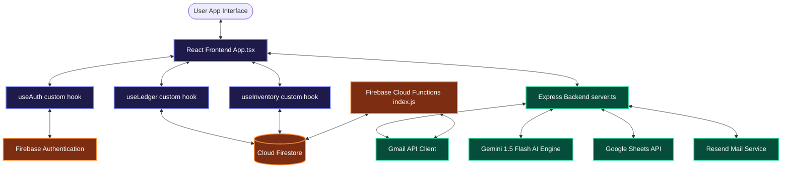
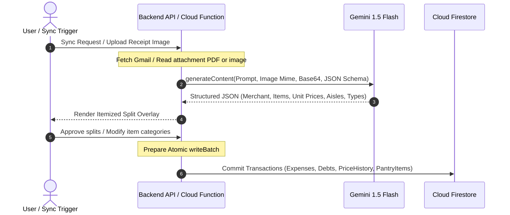

<div align="center">
  
  
  # 💸 SpendSmart Pro Edition
  
  ### *The Autonomous, Multi-Tenant Financial & Resource Ledger Powered by Gemini AI*
  
  [](package.json)
  [](https://ai.google.dev/)
  [](LICENSE)
</div>

---

## 🌟 Introduction

**SpendSmart Pro** is a state-of-the-art personal and household resource-management application. Moving far beyond generic budgeting apps, it acts as an **autonomous financial ecosystem** that merges AI-driven expense auditing, shared household ledgers, real-time pantry inventory forecasting, automated deal scraping, and detailed business transaction logging.

The system is designed with a premium, sleek dark-mode interface utilizing glassmorphism, micro-animations, and dynamic data visualizers to present a luxury desktop-native aesthetic.

---

## 🏗️ System Architecture & Logic Design

SpendSmart Pro is engineered using a robust, decoupled architecture that pairs a high-performance **React 19 Single Page Application (SPA)** with an **Express.js orchestration server**, backed by a cloud-native **Firebase suite (Authentication, Firestore, Cloud Functions)**.

### 🌐 Architectural Overview



---

## ⚡ Core Modules & Deep-Dive Logic

### 1. AI-Powered Expense Auditing & OCR Pipeline
SpendSmart Pro integrates a multi-layered OCR pipeline that processes receipts (PDF/images) via the **Gemini 1.5 Flash** model with strict structured JSON schema formatting.



> [!IMPORTANT]
> **Data Integrity Guardrails:** The transaction splits are processed atomically. If any write to `pantryItems`, `priceHistory`, `debts`, or `expenses` fails, the entire transaction is rolled back in Firestore. This prevents half-written split balances between roommates.

---

### 2. Multi-Tenant Ledger & Split Settlements
* **Dynamic Split Ratios:** Expenses can be split evenly, proportionally, or assigned entirely to a single household member.
* **Smart Debt Engine:** Calculates pairwise outstanding balances (`owedTo` vs `owedBy`) dynamically, generating `DebtRecord` logs.
* **Shared Workspace Hub:** Household groups share a virtual space in which actions are logged with real-time updates using Firestore `onSnapshot` listeners.

| Feature | Single-User Ledger | Shared Household Ledger |
| :--- | :--- | :--- |
| **Auth Context** | Individual UID | Household Space ID Index |
| **Pantry Access** | Private Aisle | Collaborative Inventory (Shared) |
| **Split Options** | 100% Personal | Proportional, Custom Weighting |
| **Debt Resolution**| Auto-Cleared | Pairwise `DebtRecord` Settlement Logs |

---

### 3. Smart Pantry & AI Expiry Alert Engine
Pantry items are categorized as `food`, `supply`, `asset`, or `service` to handle resource tracking uniquely:
* **Quantities & Burn Rates:** The system records average depletion rates, calculating exactly when products are likely to run out.
* **Nutrition Spectrum Bar:** Food items are auto-tagged by Gemini as `Essential`, `Balance`, or `Indulgence`. The UI visualizes this breakdown through an interactive horizontal bar.
* **Cron Automated Alerts:** A server-side scheduler (powered by `node-cron` and `Firebase Scheduler`) executes daily to analyze burn rates. If an item drops below 25% or approaches its expiry threshold:
  * An automated email is dispatched via the **Resend API** detailing expiring pantry goods.
  * A recipe recommendation is triggered to use up the expiring food before it spoils.

---

### 4. Interactive AI Meal Planner & Recipe Generator
Located inside the **Meals** tab, this engine uses Gemini 1.5 Flash to synthesize gourmet, health-conscious recipe suggestions based entirely on items currently in stock inside your pantry.
* **Hardware & Constraint Filters:** Adjust suggestions based on kitchen appliances (e.g., Oven, Airfryer, Slowcooker) and prep time.
* **Auto-Shopping List Sync:** If a recommended recipe requires ingredients not present in the inventory, the AI lists them as `missingIngredientsToBuy`. With a single tap, these are added to the shared household collaborative shopping list.

---

### 5. Gig & Business Ledger
Designed specifically for creators, gig-workers, and music professionals:
* **Income & Expense Channels:** Logs income streams from Bandcamp sales, live gigs, streaming royalties, and business gear.
* **Tax Deductibles & VAT Tracking:** Built-in calculators for tax-deductible items supporting varying VAT rates (0%, 9%, 21%).
* **Visual Reports:** Professional analytics showing net earnings, tax liability estimates, and operational cost breakdowns.

---

### 6. Cloud Integrations & Scraping Engine
* **Gmail Invoice Sync:** Extracts invoice receipts directly from specified email filters, preventing manual bookkeeping.
* **Google Sheets Cloud Backup:** Syncs the current application state (expenses, budgets, and recurring ledgers) directly to a formatted spreadsheet inside the user's Google Drive.
* **AI Deals Finder & Proxy Scraper:** Proxies request URLs (e.g., local grocery discount pages), removes heavy boilerplate and styles via `cheerio`, feeds clean text markup to Gemini, and isolates active discounts that match items in the user's pantry.

---

## 🎨 UI/UX & Design Philosophy

SpendSmart Pro features a customized, premium visual design crafted with **Tailwind CSS v4** and **Motion (framer-motion)**.

* **Curated Dark-Mode Theme:** Built around dark obsidian backgrounds (`#0a0a0a`), deep card containers (`#161616`), and luminous neon highlights (emerald for surplus/income, violet for premium systems, and amber for alerts).
* **Glassmorphism & Depth:** Incorporates `backdrop-filter: blur(12px)` and thin semi-transparent white borders (`border-white/5`) to mimic high-end desktop operating systems.
* **Micro-Animations:** Accordion transitions, smooth page changes, interactive charts (using **Recharts**), and spring-based tactile gestures on button presses provide direct visual feedback.
* **Fully Responsive:** Adapts from mobile viewports to large-screen monitors using tailwind grid structures.

---

## 🛡️ Security, Guardrails & Governance

* **Firestore Security Rules:** Fully secured rules block unauthorized reading/writing. Users can only read/write expenses under their own UID, and household data is restricted to verified group members.
* **Strict Prompt Guidelines:** All AI requests use localized API calls, escaping prompt injections by passing strict input boundaries and type schemas.
* **Secure Token Handling:** Google OAuth tokens are saved securely on the filesystem (`google-tokens.json` in local production) and sent only via encrypted callbacks.

---

## 🚀 Installation & Local Setup

### 📋 Prerequisites
* **Node.js** (v18 or higher)
* **Firebase Project** (with Authentication, Firestore, and optionally Cloud Functions enabled)
* **Gemini API Key** (from [Google AI Studio](https://aistudio.google.com/))

### 🛠️ Step-by-Step Installation

1. **Clone the Repository**
   ```bash
   git clone https://github.com/JaipaNero/smart-tracker.git
   cd smart-expense-tracker
   ```

2. **Install Dependencies**
   ```bash
   npm install
   ```

3. **Configure Environment Variables**
   Create a `.env` file in the root directory and specify the following variables:
   ```env
   # API Keys
   GEMINI_API_KEY="your-gemini-api-key"
   RESEND_API_KEY="your-resend-api-key"

   # Google OAuth Credentials (for Gmail and Sheets Sync)
   GOOGLE_CLIENT_ID="your-google-client-id"
   GOOGLE_CLIENT_SECRET="your-google-client-secret"
   APP_URL="http://localhost:3000"

   # Server Config
   PORT=3000
   NODE_ENV="development"
   ```

4. **Initialize Firebase Config**
   Ensure `firebase-applet-config.json` is configured in the root with your active Firebase project credentials.

5. **Start the Development Server**
   ```bash
   npm run dev
   ```
   *Your client interface will be available at [http://localhost:3000](http://localhost:3000).*

---

## 🧪 Verification & Commands Guide

### Available Scripts
* `npm run dev`: Runs the full stack (Express API + Vite React build server) using `tsx`.
* `npm run build`: Bundles the React frontend inside the static `dist/` directory.
* `npm run start`: Runs the pre-compiled server in production.
* `npm run lint`: Validates TypeScript type-safety across the project.
* `npm run clean`: Cleans compilation and build outputs.

---

<div align="center">
  <sub>Built with ❤️ by the Google DeepMind Antigravity Team for JaipaNero.</sub>
</div>
